Using R on Google Colab
---

## 1. Introduction

- **Google Colab** is a free (usage-limited) hosted notebook environment provided by Google.  
- Runs entirely in the cloud — no local installation required.  
- Commonly used for data science, machine learning, and deep learning workflows.  


### _Language Support_

- Traditionally, Google Colab has been available primarily for **Python** users.  
- A recently shared method/tip enables running **R natively on Google Colab**.  
- This allows users to write and execute R code directly in Colab notebooks.  

### _Pre-Installed R Packages_

The R runtime environment comes with many packages pre-installed, including:

- **tidyverse**  
- **ggplot2**  
- **dplyr**  
- **readr**  
- **tibble**  
- **ggsci** — for scientific journal and sci-fi themed color palettes  

### _Benefits for R Users_

- No need for local R / RStudio setup  
- Access to free cloud compute resources  
- Easy notebook sharing and collaboration  
- Useful for tutorials, teaching, and reproducible research

---
## 2. Setting up the R environment

### _Log in_

- Log in to your **Google account**:  
  👉 [https://myaccount.google.com/](https://myaccount.google.com/)  

### _Open an R Notebook in Colab_

- Go to the official Google Colab site:  
  👉 [https://colab.research.google.com/#](https://colab.research.google.com/?authuser=0#create=true)  
- This will open the Colab interface where you can create a new notebook.

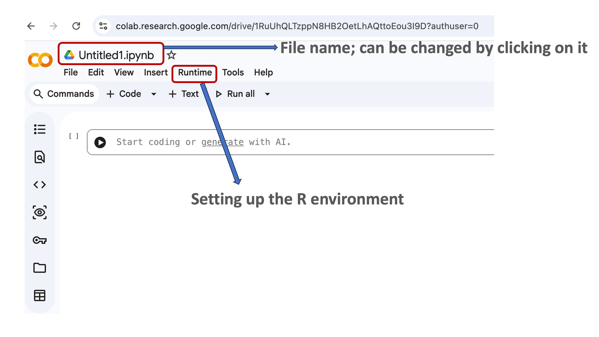

### _Verify the Runtime Language_

To confirm the notebook is running **R (not Python)**:

1. Click the **Runtime** tab in the top menu.  
2. Select **Change runtime type**.  
3. Check the **Runtime type** field.  
4. It should display **R**.

- If it shows Python, switch it to **R** and save.

 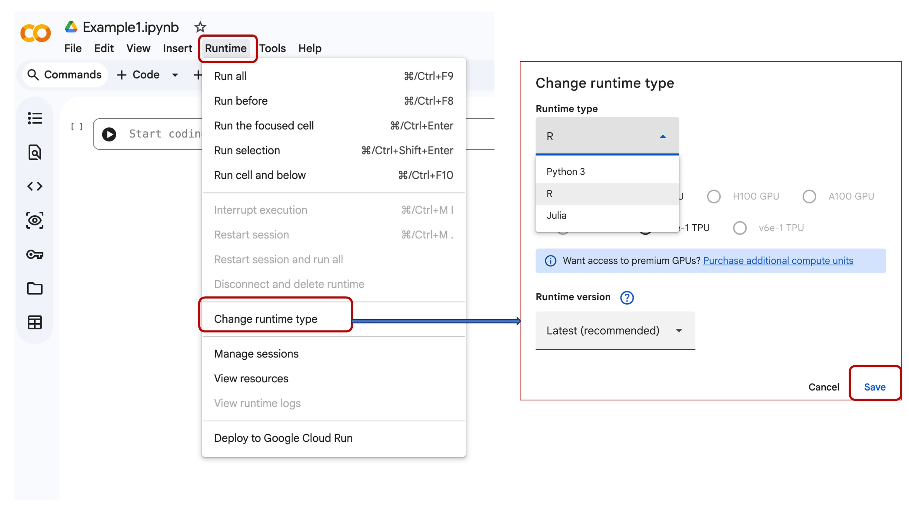

### _Check Your Google Drive Folder_

- When you run a notebook in Google Colab, a folder is automatically created in your **Google Drive**.  
- To verify this:  
  1. Open [Google Drive](https://drive.google.com/).  
  2. Look for a folder named similar to your notebook or `Colab Notebooks`.  
- This folder will store any files or outputs you save from Colab.

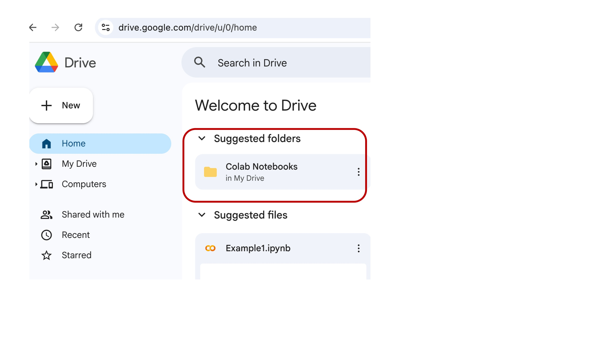


## 3. Uploading a DEG Excel File (`DEGs.xlsx`) to Google Colab

This section shows how to create a dedicated folder in Colab’s file system and upload your <a href="Data/1_R_inc_colab/DEGs.xlsx">DEGs.xlsx</a> file for downstream analysis.

 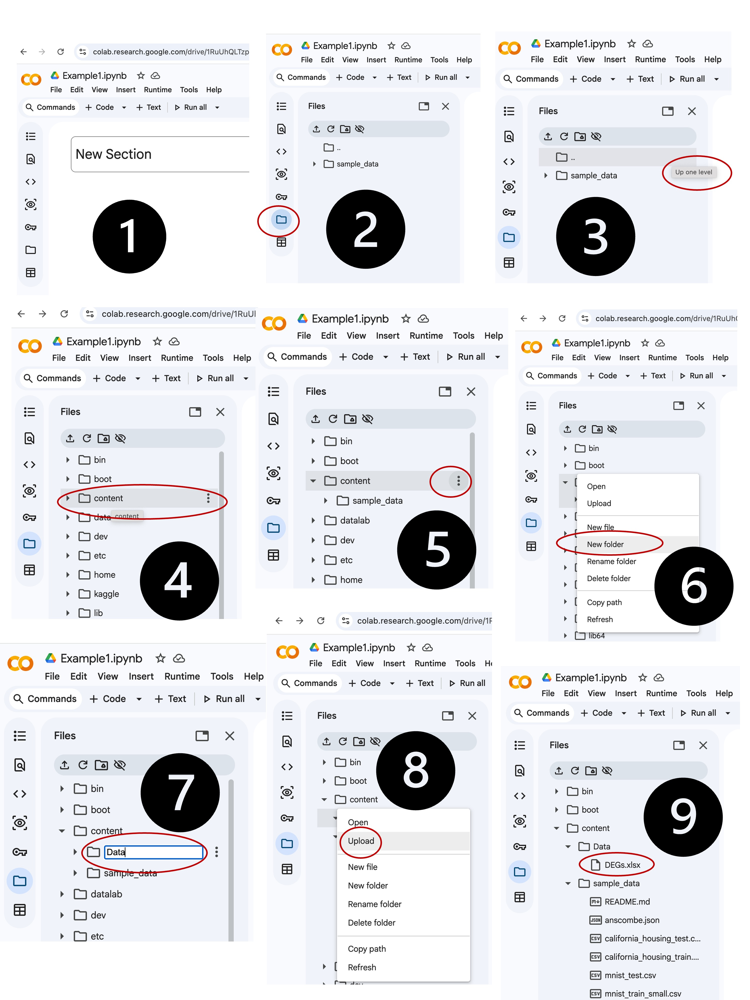

### _Start from an Empty Notebook_

1. Open your Colab notebook.
2. Make sure the **Files** sidebar (folder icon on the left) is visible.

*(Matches panel 1.)*

---

### _Open the Files Panel_

1. Click the **folder icon** on the left sidebar to open the **Files** view.
2. You should see the default folder structure (for example, `sample_data`).

*(Matches panel 2.)*

---

### _Go Up to the Root Folder_

1. In the Files panel toolbar, click the **up one level** icon (`..`) until you see folders like `bin`, `boot`, `content`, etc.
2. This brings you to the root of the Colab environment.

*(Matches panels 3–4.)*

---

### _Navigate into `content`_

1. In the Files list, find the **`content`** folder.
2. Double‑click `content` to open it.

*(Matches panel 5.)*

---

### _Create a New Folder for Your Data_

1. Inside `/content`, right‑click on the empty area (or the three‑dot menu at the top of the Files panel).
2. Choose **“New folder”** from the context menu.
3. Name the folder `Data` (or any name you prefer) and press **Enter**.

*(Matches panels 6–7.)*

---

### _Open the New `Data` Folder_

1. In `/content`, double‑click the **`Data`** folder you just created to open it.
2. The folder will be empty initially.

*(Matches panel 8.)*

---

### _Upload `DEGs.xlsx` into `Data`_

1. Inside the `Data` folder, right‑click in the empty space (or click the **more** icon in the Files toolbar).
2. Select **“Upload”**.
3. In the file picker, choose your local `DEGs.xlsx` file.
4. Wait until `DEGs.xlsx` appears in the `Data` folder list.

*(Matches panel 9.)*

---
## ⚠️ IMPORTANT Session Storage Warning

 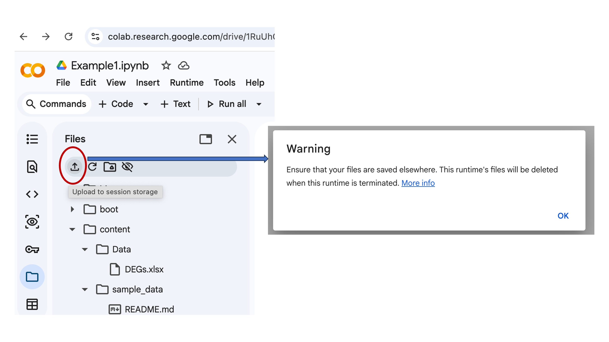


**Reader caution**: Files can also be uploaded to  the **temporary session storage only**.

- ✅ **Good for**: Quick analysis during current session
- ❌ **Avoid for**: Important data you need later

**Files DELETE automatically** when:
- Colab runtime disconnects (~90min idle)
- You close/reopen notebook
- Runtime restarts

**Always save results** to Google Drive or download before ending session in such case


## 5. Writing Your First R Program in Google Colab

**Create, run, and verify your first "Hello World" R program - copy‑paste ready!**

### _Create New R Code Cell_

1. Click **"+ Code"** button  
2. A new empty cell appears

---

### _Write First R Program_

```r
# =====================================================
# MY FIRST R PROGRAM - Google Colab Bioinformatics
# =====================================================
print("Hello World")
```

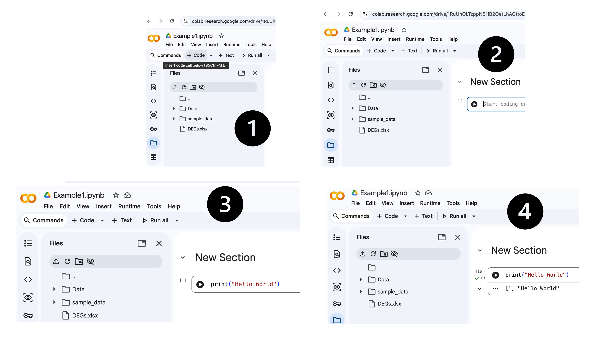


## 4. Installing R Packages for DEG Analysis

**Why packages are REQUIRED**: Base R cannot create publication-quality plots, read Excel files, or handle modern bioinformatics workflows.

### Package Requirements Table (Full Breakdown)

| Package | What It Does | Base R Problem | DEG Analysis Use | Install Time |
|---------|--------------|----------------|------------------|--------------|
| **tidyverse** | **Meta-package** loads 8 core tools | Manual loops, ugly plots | Clean Excel → volcano plots | ~2 minutes |
| **ggplot2** | Publication-quality graphics | `plot()` basic dots | Volcano/MA/heatmap plots | Included |
| **dplyr** | Data manipulation | 20-line for loops | `filter(padj < 0.05)` | Included |
| **readr** | Fast file reading | `read.csv()` slow | CSV backup for Excel | Included |
| **tibble** | Modern data frames | Row name conflicts | Clean Excel import | Included |
| **ggsci** | Journal color palettes | Rainbow colors | `scale_color_npg()` Nature | ~30 seconds |
| **openxlsx** | Excel file I/O | No Excel support | `read.xlsx("degs")` | ~45 seconds |
| **googledrive** | Google Drive access | Files lost | `drive_upload("plot.png")` | ~20 seconds |

**Total**: **3-4 minutes** → **Publication-ready bioinformatics environment**

---

## Install tidyverse ecosystem + supporting tools

This subsection demonstrates how to set up an R environment with essential packages for **data analysis, visualization, and file handling**, especially for bioinformatics and differential gene expression (DEG) workflows.

---

#### Step 1: Define Packages

```r
# Define a vector of packages to install
pkgs <- c(
  "tidyverse",   # Core data science suite:
                 # includes ggplot2, dplyr, readr, tibble, etc.
                 # → data cleaning, manipulation, plotting

  "ggsci",       # Journal-quality colour palettes
                 # → Nature, Lancet, NPG themes for publication plots

  "openxlsx",    # Excel import/export support
                 # → read DEG result files, write annotated outputs

  "googledrive"  # Cloud file management
                 # → upload plots/results, backup, collaboration
)

```

---

#### Step 2: Install Packages

```r
# Install packages and their dependencies
install.packages(
  pkgs,
  dependencies = TRUE,                 # Installs required sub-packages
  repos = "https://cloud.r-project.org/"
)
```

**Notes:**

* `dependencies = TRUE` ensures all required sub-packages are installed automatically, e.g., `assertthat`, `lazyeval`, `rex`, etc.  
* `repos` specifies the CRAN mirror to download packages from.

---

#### Step 3: Load Packages

Once installed, load the packages using `library()`:

```r
library(tidyverse)   # Data cleaning, manipulation, visualization
library(ggsci)       # Publication-quality color palettes
library(openxlsx)    # Read/write Excel files
library(googledrive) # Cloud file management
```
This setup provides a **ready-to-use R environment** for bioinformatics plotting workflows.

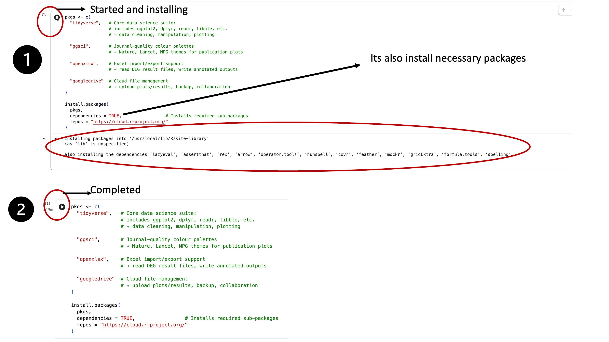


---

### Exploring the DEGs File

Now that we have our environment set up and the necessary packages installed, let's **play around a bit with our differential expression results**. We'll start by loading the DEGs Excel file and taking a quick look at its structure.

```r
library(openxlsx)

# Load the DEGs Excel file
data <- read.xlsx("/content/Data/DEGs.xlsx")

# Preview the first few rows
print(head(data))
```

**Example Output:**

| Gene_Symbol | baseMean   | log2FoldChange | lfcSE     | stat      | pvalue        | padj         |
|------------|-----------|----------------|-----------|----------|---------------|-------------|
| TSPAN6     | 2226.57161 | 0.8308230     | 0.3358922 | 2.473481 | 1.338039e-02 | 2.097445e-02 |
| TNMD       | 29.22414   | -0.8605165    | 0.5477937 | -1.570877 | 1.162112e-01 | 1.555348e-01 |
| DPM1       | 856.49137  | -0.2537967    | 0.2693102 | -0.942396 | 3.459902e-01 | 4.139467e-01 |
| SCYL3      | 612.32154  | -0.2363094    | 0.1484609 | -1.591729 | 1.114457e-01 | 1.496098e-01 |
| C1orf112   | 300.43402  | -1.1465577    | 0.1888032 | -6.072766 | 1.257260e-09 | 4.180235e-09 |
| FGR        | 356.36644  | -0.8618254    | 0.2923686 | -2.947736 | 3.201108e-03 | 5.495173e-03 |

---

#### What We See

- `Gene_Symbol`: Name of the gene  
- `baseMean`: Average normalized expression across samples  
- `log2FoldChange`: Magnitude and direction of differential expression  
- `lfcSE`: Standard error of the log2 fold change  
- `stat`: Test statistic (e.g., from Wald test)  
- `pvalue` and `padj`: Significance values (adjusted for multiple testing)

This gives us a quick **snapshot of the DEGs table**, and next we can start filtering, visualizing, and summarizing these genes for further analysis.

### Using AI to Generate Plots

Once we have our DEGs table ready, we can **leverage AI to help generate publication-quality plots**. For example, we can ask the AI:

> "Use the data table to make a fancy volcano plot."

The AI will then generate the R code for the plot, which we can run directly to produce the visualization.  

 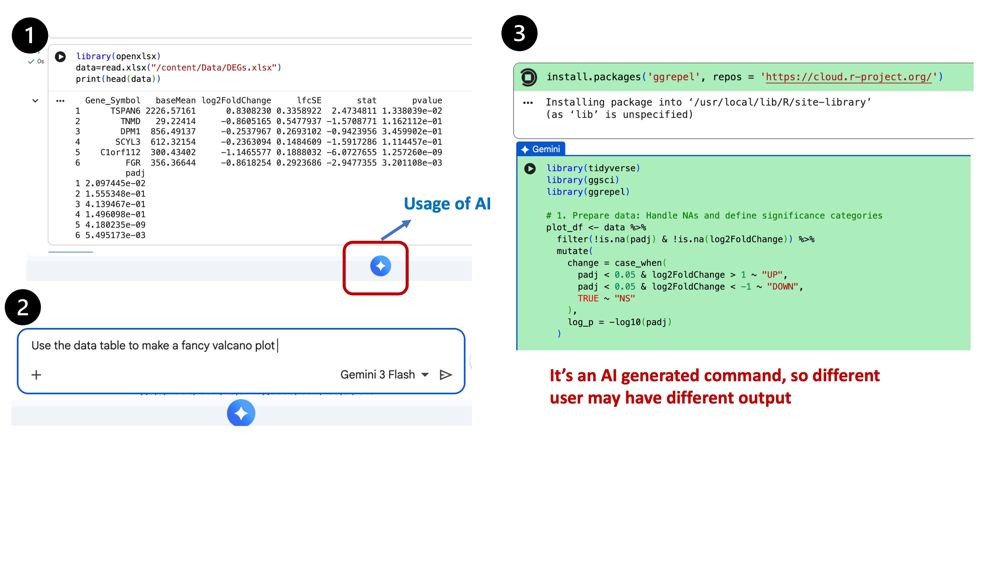

  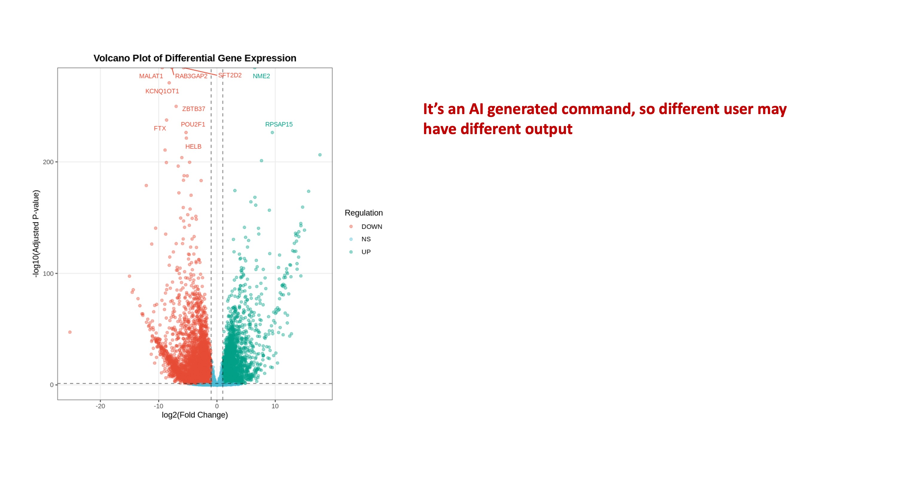

#### Adjusting the Plot

We can further improve the plot by **customizing font size, point size, colors, and exporting it**. For example, we could give the command:

> "Increase the font size and provide a PDF link to download."

The AI can then generate updated code like:

 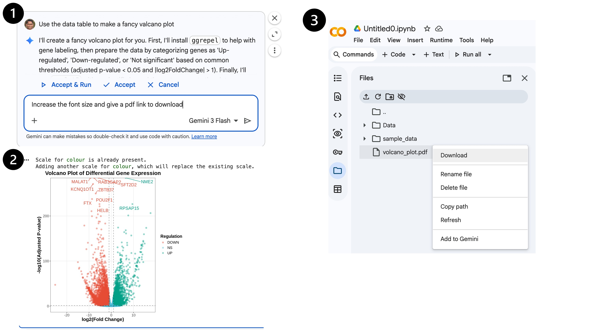

After running the code above, the volcano plot will be **saved as a high-quality PDF**, ready for presentations or publications.


#### Customizing Colors

For publication-quality figures, we can also **adjust the color palette and color intensity** to match specific journal themes. For example:
>"Adjust the color code from the ggsci for the lancet journal"

 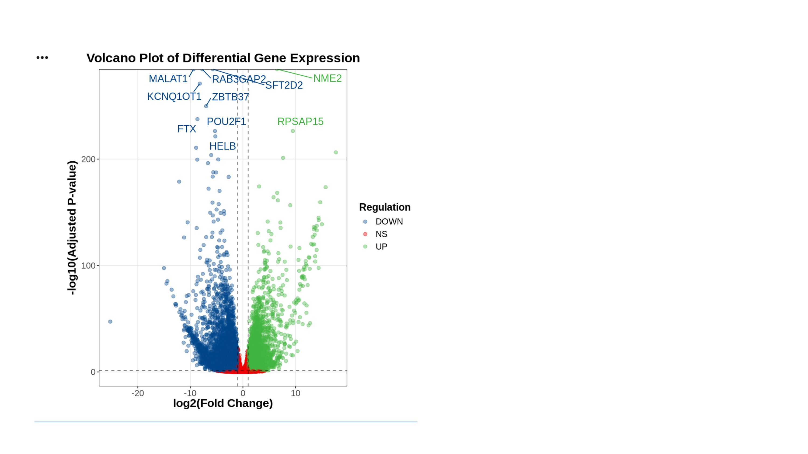


>"change the color intensity to 70%"


 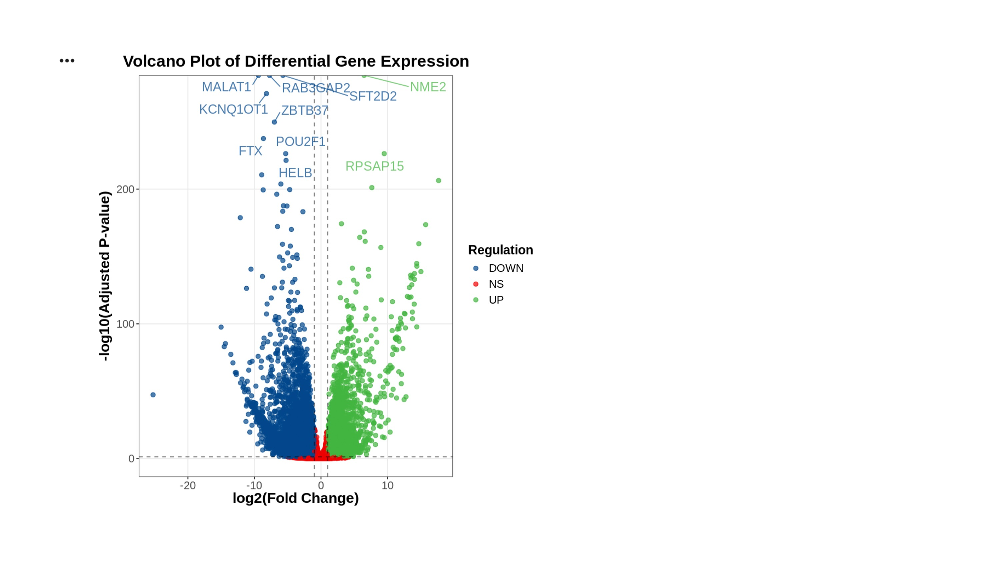


- **Lancet Journal Palette**: Using `ggsci`, you can select the Lancet color scheme to make your volcano plot visually consistent with the journal's style.  
- This involves mapping the significance categories (e.g., `padj < 0.05`) to the Lancet colors, ensuring significant genes stand out while maintaining a clean and professional look.  
- Other color palettes in `ggsci` include Nature, NPG, and JAMA themes, which can be chosen depending on the target journal or presentation style.  

By combining **AI-generated code** with **ggsci color palettes**, you can create **high-quality, publication-ready plots** quickly and easily.

---

This workflow shows how **AI can accelerate data visualization**, helping both beginners and experts quickly generate and refine complex plots.

---

